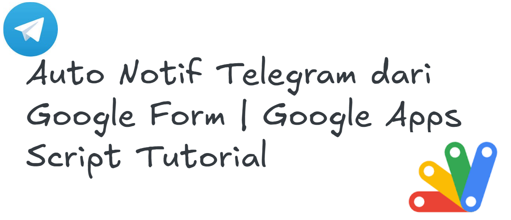
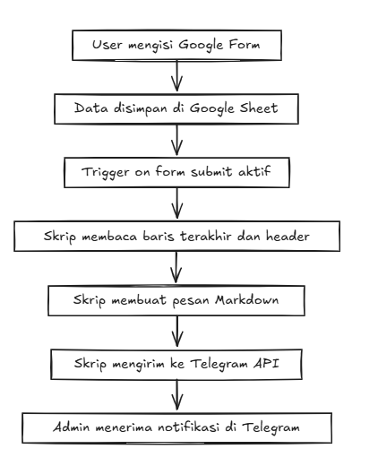

  
  
  
  

<h1 align="center">📢 Auto Notifikasi Telegram dari Google Form</h1>

  

Panduan ini akan membantu kamu membuat <b>notifikasi otomatis di Telegram</b> setiap kali ada data baru masuk dari Google Form. 
Cocok untuk: 📋 Form Registrasi, 🛒 Order Form, 📌 Feedback Form, dll.

---

## 📷 Preview

<i>Contoh form yang digunakan untuk mengumpulkan data.</i>

  

<i>Ilustrasi alur proses dari form sampai notifikasi terkirim ke Telegram.</i>

---

## ✅ Fitur
| Fitur | Deskripsi |
|------|-----------|
| ⚡ **Realtime** | Notifikasi terkirim segera setelah form di-submit |
| 📝 **Pesan Terformat** | Menggunakan Markdown agar pesan rapi |
| 🤖 **Integrasi Telegram** | Kirim langsung ke chat/grup admin |
| 🛡️ **Aman** | Token & Chat ID hanya disimpan di Apps Script |

---

## 🛠️ Persiapan
Sebelum memulai, pastikan kamu sudah punya:  

- 🟢 **Akun Google** (untuk buat Google Form & Apps Script)  
- 📄 **Google Form** yang terhubung dengan **Google Sheet**  
- 🤖 **Bot Telegram** → buat di `@BotFather` & ambil **Token**  
- 💬 **Chat ID** → dapatkan lewat [getUpdates](https://t.me/chatIDrobot)  

---

## 📝 Setup Google Form & Google Sheet
1. Buka **Google Form** → buat pertanyaan (Nama, Email, Pesan, dsb.)  
2. Klik menu **Responses → Link to Sheets**  
3. Buat spreadsheet baru untuk menampung data form.  

---

## 💻 Konfigurasi Google Apps Script
Buka **Google Sheet** → klik **Extensions → Apps Script** → hapus kode bawaan → buat file baru bernama `Kode.gs`, lalu masukkan kode berikut:  
- ubah token bot yang sudah di buat di botfather pada baris kode 4
- ubah chat id pada baris kode 5
## demo
- google form https://forms.gle/H1ty7XqhPoyaZ7EHA
- rekap data - https://docs.google.com/spreadsheets/d/12jebNirsMelIfIfswd5z-aB_m-bsLaL0tpgQx67VylI/edit?usp=sharing
- notif masuk ke - t.me/notiform